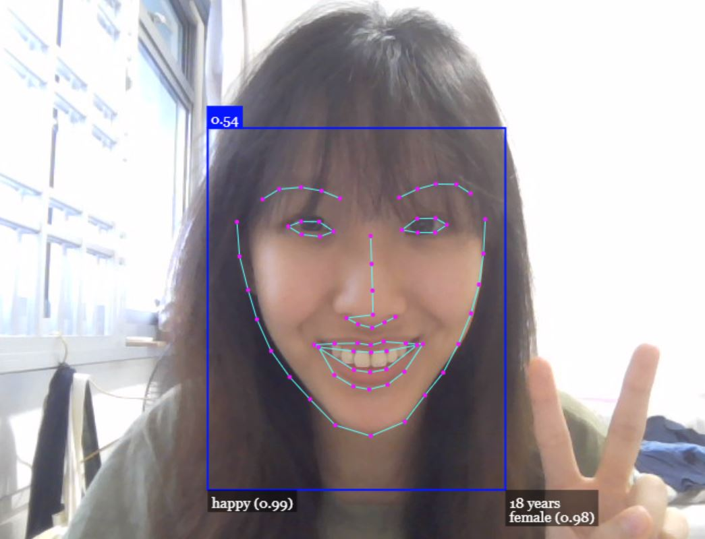
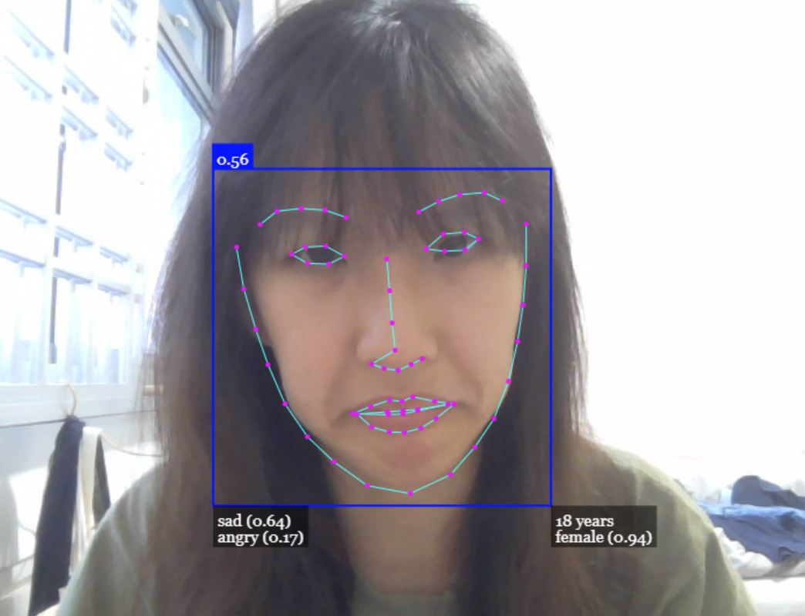
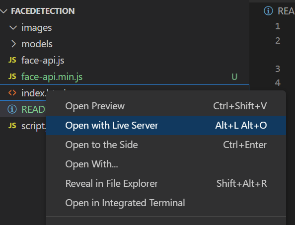

# Face Detection
This project is a DIY Face Detection that can detect faces, guage their expressions, map facial features and predict the face's gender and age.

## Installation
1. Open the project in VS code
2. Ensure that you have installed the Live Server extension in VS code. Right click on index.html and click on 'Open With Live Server'

## Technology Stack
This project was built with Javascript. It uses the [face-api library](https://github.com/justadudewhohacks/face-api.js) by [justadudewhohacks](https://github.com/justadudewhohacks).

## Developer's Thoughts
This is my first project which dabbles into using Artificial Intelligence (AI). AI is such a hot topic now that I have wanted to try a project on it for the longest time. I want to build my own AI models next, perhaps in a future project! 

I followed the tutorial in this link to guide me, but I added the implementation of age and gender prediction which was not covered in the tutorial: https://www.youtube.com/watch?v=CVClHLwv-4I&ab_channel=WebDevSimplified